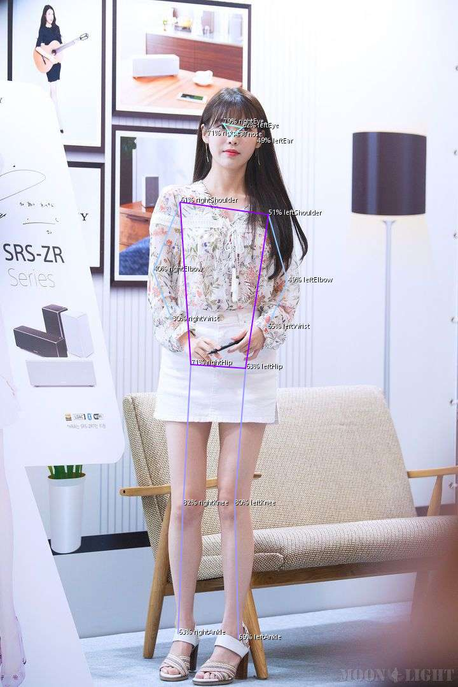

# MoveNet Body Segmentation & Extract Angles for TFJS & NodeJS

Models are included in `/model-*` folders  

Supports:

- `MoveNet-Lightning` **v3** and **v4**
- `MoveNet-Thunder` **v3** and **v4**
- `MoveNet-Multipose` **v1**

Performance:

- Lightning v3: 5.450ms
- Lightning v4: 5.481ms
- Thunder v3: 10.388ms
- Thunder v4: 10.508ms
- Multipose: 11.217ms

<br>

## Implementation

모델 파싱 구현 코드의 메인은 `movenet.js` 이며, native TFJS ops 와 JavaScript로 실행합니다.<br>
 `processResults()` 에서 `model.execute` 결과를 확인하여, 총 17개의 joint의 array를 받습니다. <br>
 이후 해당 joint의 x, y 좌표값을 기반으로 총 10개의 angle을 추출하여<br>
 이를 csv 파일로 인덱싱 후 저장합니다. <br>
 해당 csv 파일을 기반으로 자세 분류 머신러닝에 학습데이터로써 사용합니다. <br>

- id
- score: score as number
- label: annotated body part as string
- xRaw: x coordinate normalized to 0..1
- yRaw: y coordinate normalized to 0..1
- x: x coordinate normalized to input image size
- y: y coordinate normalized to input image size

<br><hr><br>

## Example



## Test

```shell
node movenet.js
```

```js
2022-11-27 21:00:52.186066: I tensorflow/core/platform/cpu_feature_guard.cc:151] This TensorFlow binary is optimized with oneAPI Deep Neural Network Library (oneDNN) to use the following CPU instructions in performance-critical operations:  AVX2
To enable them in other operations, rebuild TensorFlow with the appropriate compiler flags.
2022-11-27 21:00:52 INFO:  movenet version 0.0.1
2022-11-27 21:00:52 INFO:  User: savet Platform: win32 Arch: x64 Node: v18.12.1
2022-11-27 21:00:52 INFO:  Loaded model { modelPath: 'file://model-lightning3/movenet-lightning.json' } tensors: 178 bytes: 9299876
2022-11-27 21:00:52 INFO:  Model Signature {
  inputs: { 'input:0': { name: 'input:0', dtype: 'DT_INT32', tensorShape: { dim: [ { size: '1' }, { size: '192' }, { size: '192' }, { size: '3' } ] } } },
  outputs: { 'Identity:0': { name: 'Identity:0', dtype: 'DT_FLOAT', tensorShape: { dim: [ { size: '1' }, { size: '1' }, { size: '17' }, { size: '3' } ] } } }
}
2022-11-27 21:00:52 INFO:  Loaded image: inputs/test1.jpg inputShape: [ 420, 277, 3 ] modelShape: [ 1, 192, 192, 3 ] decoded size: 3490202022-11-27 21:00:52 INFO:  Inference time: 251 ms
2022-11-27 21:00:52 INFO:  Tensor output [ 1, 1, 17, 3 ]
2022-11-27 21:00:53 INFO:  Loaded image: inputs/test2.jpg inputShape: [ 1078, 720, 3 ] modelShape: [ 1, 192, 192, 3 ] decoded size: 2328480
2022-11-27 21:00:53 INFO:  Inference time: 98 ms
2022-11-27 21:00:53 INFO:  Tensor output [ 1, 1, 17, 3 ]
2022-11-27 21:00:54 STATE: Created output image: outputs/test1.jpg size: [ 277, 420 ]
2022-11-27 21:00:54 STATE: Created output image: outputs/test2.jpg size: [ 720, 1078 ]
```

<br><hr><br>

## Credits

- Article <https://blog.tensorflow.org/2021/05/next-generation-pose-detection-with-movenet-and-tensorflowjs.html>
- Model Card SinglePose: <https://storage.googleapis.com/movenet/MoveNet.SinglePose%20Model%20Card.pdf>
- Model Card MultiPose: <https://storage.googleapis.com/movenet/MoveNet.MultiPose%20Model%20Card.pdf>
- Original NPM Package: <https://www.npmjs.com/package/@tensorflow-models/pose-detection>
- Model Download - Lighning variation: <https://tfhub.dev/google/movenet/singlepose/lightning/3>
- Model Download - Thunder variation: <https://tfhub.dev/google/movenet/singlepose/thunder/3>
